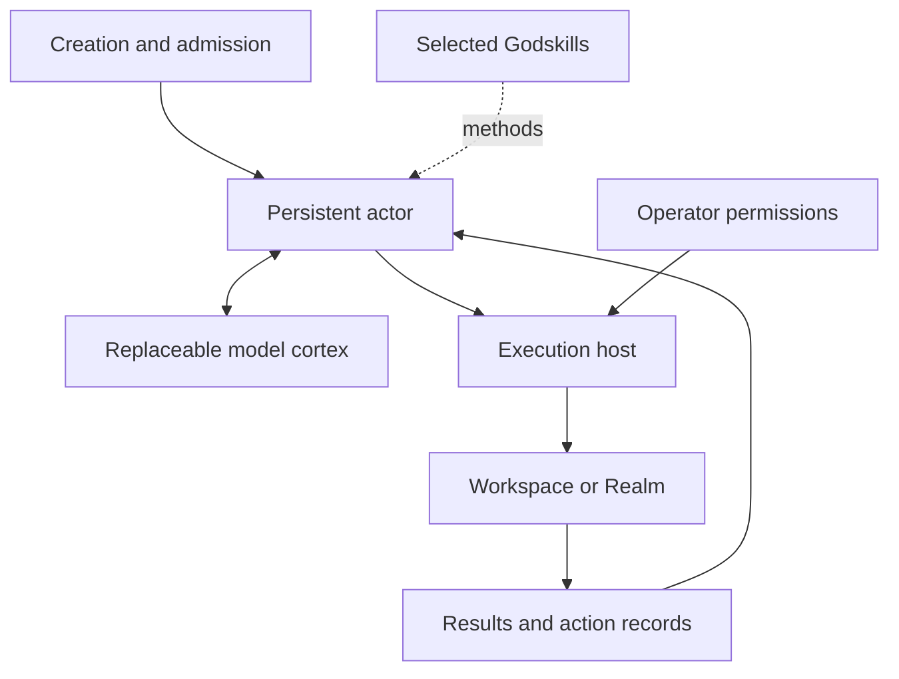

# Eternities Godagents

### Persistent actors. Replaceable models. Accountable action.

Godagents is an experimental runtime and creation system for AI actors whose
identity, commitments, and history live outside the model doing their reasoning.
It connects those actors to selected skills and real execution hosts, with explicit
permissions and records of what happened.

**[Try the local demo](#try-it-locally)** · **[Understand the architecture](docs/concepts.md)** ·
**[Use a coding host](docs/native-pi-operator.md)** · **[Project update](docs/project-update-2026-09-25.md)** ·
**[Explore the docs](docs/README.md)**

## Why Godagents?

An actor needs more than a prompt to carry responsibility across tasks. It needs
an identity that survives a new session, a clear scope of action, and a way to
recover unfinished work without blindly repeating its effects.

Godagents separates those responsibilities:

- **Keep identity outside the cortex.** The model supplies cognition; the actor's
  constitution, mission, and recorded history have their own lifecycle.
- **Make capabilities explicit.** Optional Godskills supply selected methods.
  The host grants tools and effects; skill text cannot grant permission.
- **Use mature execution hosts.** The native Pi adapter reuses Pi's file, edit,
  shell, context, and session loop while associating it with an admitted actor.
- **Account for consequences.** Journals, action receipts, and reconciliation
  preserve completed, failed, interrupted, and uncertain outcomes.

## Try it locally

Requires **Node.js 24 or newer** and Git. The local demo needs no package install,
API key, model download, or sibling repository.

```sh
git clone https://github.com/xnuonux/eternities-godagents.git
cd eternities-godagents
npm run demo
```

The demo compiles an actor from the included fixtures, authorizes one counter
increment, and saves its event journal in a new directory for each run.
Look for these fields in the output:

```json
{
  "mode": "deterministic-fixture",
  "instanceId": "godagent-demo-1",
  "expectedCounter": 1,
  "observedCounter": 1,
  "discrepancyClass": "none"
}
```

This is a deterministic demonstration of the local actor lifecycle. Real model
execution is a separate setup. Follow the **[quickstart](docs/quickstart.md)** to
inspect the journal and choose the next path.

## How the pieces fit



| Concept | Responsibility |
| --- | --- |
| **Actor** | Identity, purpose, constitution, and mission state. |
| **Cortex** | Model reasoning and generation through an explicitly bound adapter. |
| **Godskill** | A selected method or capability guide, independently usable outside Godagents. |
| **Host** | Tools, sessions, provider access, and enforcement of the operator's grants. |
| **Realm** | The environment being observed or changed, with declared actions and effects. |
| **Continuity** | Recorded state and provenance used to resume work and reconcile outcomes. |

See **[concepts and boundaries](docs/concepts.md)** for the distinction between
the local governed loop and the native coding-host integration.

## What works today

**Experimental developer tooling, version 0.2.0.** The package is private and is
used from a checkout; this is not an npm installation or a finished hosted product.

| Path | Evidence and maturity |
| --- | --- |
| Local creation, admission, and actor lifecycle | Implemented, with deterministic tests and versioned evidence. |
| Native Pi coding host | Implemented; recorded live Grok coding and session-continuation trials. Setup requires an installed compatible SDK, provider access, and an admitted actor. |
| Optional Godskills binding | Implemented; selection and continuity mechanics are tested. A general quality improvement has not been established. |
| Recovery and review | Several interruption/reconciliation cases are tested. Coverage is bounded; model review remains advisory. |
| Additional hosts and resident integration | Further qualification and product work. Soul activation, autonomous evolution, and Lunari integration are outside this release. |

Read the **[current state and dated evidence](docs/current-state.md)** before
relying on a particular integration. Historical test counts describe their exact
source revision; they are not a live build badge.

The [portable smoke workflow](.github/workflows/portable-smoke.yml) checks the
demo and local runtime separately from the full release gate. See its
[actual run results](https://github.com/xnuonux/eternities-godagents/actions/workflows/portable-smoke.yml).

## Choose your next step

- **Understand the design:** [Concepts](docs/concepts.md) and [technical architecture](docs/architecture.md).
- **Run a real coding mission:** [Native operator](docs/native-pi-operator.md) and [host binding](docs/native-pi-session.md).
- **Build an integration:** [SDK exports](src/sdk/index.mjs), [native SDK](src/sdk/native-pi.mjs), and [documentation map](docs/README.md).
- **Improve the project:** [Contributing](CONTRIBUTING.md) and [product roadmap](docs/roadmap.md).
- **Inspect the implementation history:** [Detailed reference](docs/reference/implementation-ledger.md) and [audit records](docs/audits/).

## Part of Eternities

Godagents develops the creation and runtime foundations for persistent actors
within Eternities. [Godskills](https://github.com/xnuonux/eternities-godskills)
provides reusable expertise; [the Eternities canon](https://github.com/xnuonux/eternities-canon)
records the wider product and research direction. These projects remain distinct.

The current runtime establishes engineering mechanisms for identity and action;
it does not establish consciousness or a completed resident system.

## License and source use

This repository does not currently declare a project-wide license. Do not assume
an open-source license from public visibility. Warehouse research and any future
code reuse must preserve source attribution and applicable license terms.
