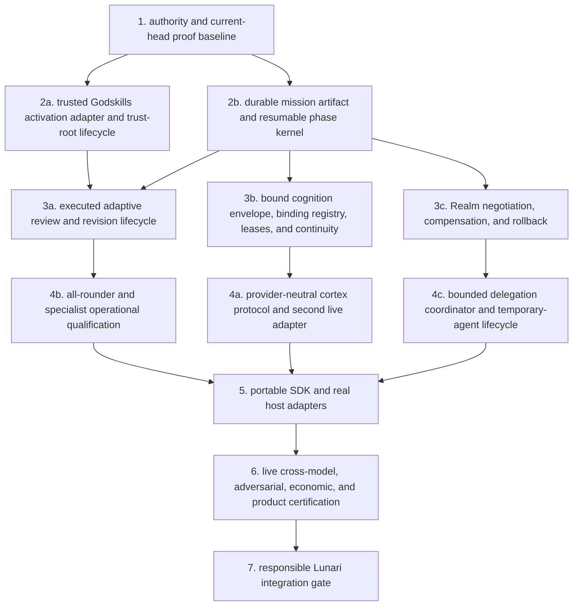

# universal godagents gap audit

date: 2026-08-30
godagents evidence head: `51fc2926a7e855a62a00223eb5d1c8e6efc6264f` (`main`, equal to `origin/main` at audit start)
godskills evidence head: `2c6a51733741ff06f44485331a14810cfb9fa1f1` (`main`, equal to `origin/main` at audit start)
scope: evidence audit only. no runtime implementation, Lunari integration, Soul activation, Inspiration activation, or model-routing change is authorized by this document.

post-snapshot note: while this audit was under independent review, local Godskills `main` advanced to docs-only commit `175f194640c807d7f9b78cfbdab3b1fba832bb21`, adding `C:/dev/eternities-godskills/docs/superpowers/specs/2026-08-30-godskills-evolution-arc-design.md`. `origin/main` remained `2c6a517`; no audited runtime, adaptive report, adaptive evidence, receipt, or test file changed. the evidence baseline above therefore remains the reproducible point-in-time source for this audit. the full Godskills suite was also rerun at `175f194` with `632` passes and `0` failures.

## executive verdict

godagents is a strong deterministic local governed-vessel prototype with eight historical certification-receipt scopes. one is the bounded Godskills v3 integration receipt, and none is blanket current-head product certification. godagents is not yet a genuinely usable universal Godagent runtime.

the repository already has real strengths: immutable identity and constitution boundaries, local journaled persistence, deterministic replay, capability and effect ceilings, transactional genesis, local creation and admission, a bounded OpenAI-compatible cortex adapter, a bounded temporary-worker contract, and a receipt-bound Godskills v3 mission adapter. those are substantive foundations, not empty fixtures.

the remaining critical gap is not another schema. the runtime has no durable mission artifact and no resumable multi-phase execution kernel. therefore its `review` activation can only schedule a descriptor after the native attempt; it cannot execute a later critique, revision, acceptance, or rejection cycle. the same missing lifecycle blocks robust long-horizon work, live multi-agent coordination, cross-model qualification, product recovery, and meaningful time-travel forensics.

the universal claim must also remain qualified. current runtime code supports one internal OpenAI-compatible cortex contract, one fixed local counter Realm, and one mission per process. there is no public SDK surface, no Claude Code, Codex, local-model, or MCP adapter, no live provider-quality certification, and no production host certification. `provider-neutral` is presently an architectural intention and seam, not a demonstrated multi-provider product property.

## what happened in godskills

the Godskills adaptive-amplification experiment did not establish that full skill-method injection is generally superior. blind visual trials favored raw Terra in three of four tasks. the Godskill path also used `2.73x` the prompt bytes in the measured white-fire comparison and took `44%` more wall time. the Muse-guided candidate won only the bioluminescent-ecosystem task. this is recorded in `C:/dev/eternities-godskills/docs/adaptive-amplification-report.md:16-38` and the four-task evidence in `C:/dev/eternities-godskills/artifacts/adaptive-activation/evidence.v1.json:27-61`.

that result was a useful falsification, not a reason to discard Godskills. Godskills v3 now distinguishes `native`, `guardrail`, `method`, and `review`, preserves raw model capability as the floor, and leaves automatic promotion disabled. the adaptive receipt is explicitly `experimental`; it does not prove automatic review execution or global activation. see `C:/dev/eternities-godskills/docs/adaptive-amplification-report.md:42-73`, `C:/dev/eternities-godskills/docs/adaptive-amplification-report.md:152-164`, and `C:/dev/eternities-godskills/receipts/adaptive-activation-v1.json`.

the Godagents consequence is precise: use the certified Godskills boundary, but do not inject full methods by default and do not mistake a scheduled review descriptor for a review that actually ran.

## audit-run verification performed

the auditor observed the following reproducible command results at the exact heads above. they are not independently signed test-output artifacts or new certification receipts:

- godagents `npm test`: `332` passed, `0` failed.
- godskills `npm test`: `632` passed, `0` failed at snapshot head `2c6a517`; the same `632/0` result was observed after the docs-only advance to `175f194`.
- godagents `npm run verify:certifications`: eight-receipt ledger verified, ledger digest `104652eefc87dea908d6a27018d657656308811a3cfb78fce895aa7509ef9f44`.
- godagents `npm run verify:release-lineage`: verified, digest `49ee0ee70d90236c0a4c7439b811fcd386a1f1baa4d4d79de0d418c28c3673f6`.
- both repositories were clean and equal to their configured origins at audit start.

these observed results support test and receipt integrity at the audited heads. reproduce them with the four commands shown above. they do not convert historical certification claims into current-head live product certification. `docs/architecture.md:124-134` explicitly requires recertification for changed current-head claims and explains the fixture and fake-transport limits.

## disposition vocabulary

- **certified and genuinely complete**: complete only within a narrow, receipt-stated boundary at its certified source commit.
- **implemented but not certified**: executable current code exists, but no matching independent certification receipt proves the claim.
- **structurally present but dormant**: schemas or data structures exist, but a normal host path does not use them materially.
- **partially implemented**: some operational path exists, but an essential lifecycle, provider, recovery, or quality property is absent.
- **specified but absent**: a design or requirement exists without corresponding runtime implementation.
- **intentionally excluded**: the repository explicitly keeps the system out of the current trust boundary.
- **stale or contradictory**: documentation or authority pointers disagree with current code, receipts, or repository state.
- **blocked by an unresolved architectural decision**: implementation would prematurely choose a consequential contract that has not been settled.

priority means: **p0** blocks a safe universal runtime or permits a foundational claim to outrun evidence; **p1** is required for universal operation or product proof but can follow the p0 spine; **p2** is deliberately deferred or non-critical to the present runtime path.

## ranked dependency graph

rank 1 removes authority drift and establishes what current-head evidence can prove. ranks 2a and 2b are independent bounded repairs and can proceed in parallel. rank 2a can certify classification, trust-root binding, disclosure, and adapter behavior without a mission kernel. rank 2b is required before a later review can execute and recover. ranks 3a through 3c then build operational lifecycles on those foundations. rank 4 turns structural choices into qualified behavior. rank 5 exposes a portable product surface. rank 6 tests actual providers, hostile inputs, cost, latency, recovery, and usability. Lunari is downstream of all of them.

## gap ledger

| # | priority | area | disposition | evidence for current state | exact gap and dependency |
|---:|---|---|---|---|---|
| 1 | **p0** | real adaptive review after native first attempt | **partially implemented**, operational host path also **dormant** | `src/skills/mission-binder.mjs:175-232` creates a `scheduled-not-executed` deferred descriptor. `src/runtime/vessel.mjs:371-412` moves from binding to inference, proposals, and constitutional decision without a review executor. `README.md:59-64` says a host must provide the later review. `tests/godskills-adaptive-activation.test.mjs` exercises classification and bounded packages, not executed critique/revision quality. commits `8b2d50c`, `c462fd3`, and `51fc292` shape and harden activation after the historical Godskills receipt. | no durable native artifact, post-native reviewer invocation, revision, verdict, or recovery phase exists. `src/host/local-cli.mjs:39-88` and `src/host/admitted-launch.mjs:164-199` construct the Godskills adapter without an activation resolver, so normal hosts do not activate the experiment. executed review depends on ranks 2a and 2b, then 3a. |
| 2 | **p0** | activation classification and trust-root lifecycle | **partially implemented**, current behavior **not certified** | `src/skills/activation-resolver.mjs:4-17` defines modes and task classes; `:122-188` compiles a decision; `:191-260` verifies and recovers resolver state. `src/skills/mission-binder.mjs:309-495` binds and recovers a mission. `tests/godskills-adaptive-activation.test.mjs` tests the boundary. | trusted policy and evidence digests, thresholds, and a Muse profile are duplicated and hardcoded in Godagents (`src/skills/activation-resolver.mjs:4-36`) while Godskills owns the source evidence (`C:/dev/eternities-godskills/src/adaptive-activation.mjs:3-7`, `:47-57`). there is no release rotation, revocation, migration receipt, or lifecycle for a new activation trust root. consume the exact pinned Godskills compiler through a receipt-bound adapter, then independently revalidate authority, effects, disclosure, and mode. this is rank 2a and does not require the mission kernel. |
| 3 | **p1** | all-rounder versus specialist profiles | **structurally present but dormant** and **partially implemented** | `schemas/agent-genome.schema.json:90-101` admits `all-rounder` and `specialist`. `src/skills/capability-policy.mjs:5-39` computes complete-catalog eligibility and specialist `preferredIds`. `tests/godskills-capability-policy.test.mjs:16-59` verifies structural policy. commit `300ea4d` introduced the policy. | `src/skills/mission-binder.mjs:72-88` forwards prohibitions but not `preferredIds` into router context. preferences therefore do not affect selection. no matched all-rounder/specialist quality, refusal, latency, or cost qualification exists. specialization must remain a preference unless a family is explicitly prohibited. depends on 2a, 3a, and 4b. |
| 4 | **p1** | cortex and model replacement, routing, cross-model qualification | **partially implemented** | `src/cortex/openai-compatible.mjs:175-290` provides an HTTPS OpenAI-compatible adapter. `src/cortex/inference-runner.mjs:38-127` enforces attempts and token budgets. `src/host/policy.mjs:21-75` validates endpoint, model allowlist, and budgets. `tests/vessel-migration.test.mjs:132-157` verifies fixture-level cortex replacement without identity mutation. `receipts/networked-cortex-certification.json` certifies source commit `5169334`, digest `6f2837597c099a9d0e68a8829473da3492b5ff37cf189c5708219fb546ef28dd`. | `schemas/host-policy.schema.json:9-26` permits only `openai-compatible-v1`. tests use injected or scripted transports and do not send a provider request, as stated in `README.md:225-244` and `docs/architecture.md:108-122`. there is no Claude, Codex, local-model, or MCP cortex adapter, no capability discovery, routing policy, failover qualification, or cross-model equivalence evidence. depends on 3b, then 4a. |
| 5 | **p0** | long-horizon mission execution and resumable phase transitions | **specified but absent**, with partial persistence primitives | `src/runtime/arbiter.mjs:49-51` caps a cycle at one action and returns `one-action-complete`. `README.md:205-219` says admitted launch processes one unseen mission per invocation and exits. journal, snapshot, residency, and replay primitives are present and tested. the proposed binding lifecycle is described in `docs/superpowers/specs/2026-08-30-godagent-cortex-binding-protocol-design.md:92-169`. | there is no mission artifact schema, plan/phase state machine, pause, resume, critique, revision, cancellation, deadline, or phase-transition receipt. process recovery does not equal mission recovery. this is rank 2b and the smallest universal-runtime lifecycle dependency. |
| 6 | **p1** | bounded delegation, temporary agents, multi-agent coordination | **structurally present but dormant** and **partially implemented** | `src/runtime/temporary-worker.mjs:25-69` creates an 8 KiB, observe/propose/analyze-only data envelope. `tests/temporary-worker-boundary.test.mjs:6-56` verifies that boundary. `src/runtime/scheduler.mjs:16-39` concurrently gathers internal organ proposals; `src/runtime/arbiter.mjs:22-55` deterministically selects one. | there is no worker spawn, model binding, lifecycle, cancellation, timeout, result receipt, aggregation, quorum, budget settlement, or disposal. internal organ concurrency is not a multi-agent system. depends on rank 2b and a real Realm boundary, then 4c. |
| 7 | **p0** | keel and memory interfaces without identity or authority leakage | **certified within the local v0 boundary**, but universal cognition binding is **partially implemented** | local hash-chain continuity, checkpoint promotion, and provenance admission live in `src/keel/local-reference-backend.mjs`, `src/keel/checkpoint-policy.mjs`, and `src/memory/admission.mjs`, with `tests/keel-reference-backend.test.mjs`, `tests/keel-checkpoint-policy.test.mjs`, and `tests/memory-provenance.test.mjs`. `receipts/godagent-v0-certification.json` certifies source `66edf417`, digest `400ba26a1a73857730daa3a5abd9fb6906a02a4e712f8fa2bb0f4d5e0c19c078`. | `src/cortex/openai-compatible.mjs:45-76` sends mission, observation, epoch, constraints, and an optional method envelope, but not a verified identity, constitution, telos, voice, keel projection, or continuity lease. the repository itself records this gap in `docs/superpowers/specs/2026-08-30-godagent-cortex-binding-protocol-design.md:20-24`. no collective memory or retrieval layer is claimed. depends on rank 2b and 3b. |
| 8 | **p1** | Realm Contract negotiation, tools, effects, rollback | **certified for a local fixture boundary** and otherwise **partially implemented** | `schemas/realm-contract.schema.json:5-104` defines hands, effects, lifecycle, and a `fixture-local` trust model. `src/realm/hand-contract.mjs:12-59` validates action payload and expected outcome. `src/realm/action-gateway.mjs:11-109` enforces authority, idempotency, reconciliation, and action receipts. `src/realm/local-persistent-realm.mjs:52-123` implements the counter Realm. fixture behavior is covered by `tests/local-persistent-realm.test.mjs`, `tests/action-awareness.test.mjs`, and the v0 receipt at source `66edf417`. | no runtime Realm negotiation, capability discovery, lease renewal, credential binding, external tool adapter, compensation hand, or true rollback protocol exists. discrepancy handling can repair or escalate, but that is not transactional rollback. depends on rank 2b, then 3c. |
| 9 | **p1** | creation, genesis, admission, persistence, recovery | **certified and genuinely complete only within stated local slices**; admitted launch is **implemented but not certified** | creation forge: `receipts/creation-forge-phase1-certification.json`, source `513a363`, digest `03b09ea99169f906979032ff22fbad010c11ea4b5e91bee800d77509e893831a`. transactional genesis: `receipts/transactional-genesis-phase2-certification.json`, source `2444eeb`, digest `c1ea367563444fc41d4d43900594dc8a8087574eaca692fd6d54d0f0348a6ec6`. creator protocol: source `6360a4b`, digest `9b1baa7f0538c3148b65eaaaad8adf9ed21393b318beffd9b81d555ef85c62d4`. visual creator: source `1f65ecc`, digest `a6ab44f941c7a5113975dfec0b048894a7a0338a6fb2b28b60f1c9e8760333e4`. local admission: source `b5d58ba`, digest `b1ac391d1cc0177bd503a5903fda190620d89f309c4ae2467a45c12632dc9410`. tests include `tests/creation-certification.test.mjs`, `tests/genesis-certification.test.mjs`, `tests/creator-certification.test.mjs`, `tests/visual-creator-certification.test.mjs`, and `tests/local-admission-certification.test.mjs`. | the boundaries are local and deterministic. `README.md:205-219` and `docs/architecture.md:84-88` state that admitted launch has no separate receipt and excludes provider quality, daemon operation, hostile isolation, cross-machine use, general Realm integration, evolution, Inspiration, Lunari, and Soul. current-head integrated recertification is still needed after later runtime changes. depends on rank 1 for claim hygiene and rank 5 for productization. |
| 10 | **p2** | governed evolution without self-authorized mutation | **intentionally excluded**, with a safe dependency-migration guard | `schemas/agent-genome.schema.json:111-124` freezes evolution at v0 and keeps Soul dormant. `src/skills/release-migration.mjs:73-167` permits a compatible operational dependency migration or returns `governed evolution required`. `tests/godskills-release-migration.test.mjs` verifies the boundary. `README.md:3-5` and `docs/architecture.md:84-88` exclude evolution. | no proposal, consent, evaluation, constitution check, rollback, adoption, or identity-preserving evolution runtime exists. a Godskills release upgrade is correctly treated as dependency migration, not identity mutation. any broader mutation remains blocked by unresolved evolution governance and is not on the current critical path. |
| 11 | **p1** | observability, receipts, replay, time travel, failure forensics | **partially implemented** | append-only journal, deterministic snapshots, action and cycle receipts, residency state, and replay tests provide meaningful local evidence. exact examples include `src/state/journal.mjs`, `src/state/snapshot.mjs`, `schemas/action-receipt.schema.json`, `schemas/godskills-cycle-receipt.schema.json`, `tests/journal-recovery.test.mjs`, `tests/persistent-vessel.test.mjs`, and `tests/receipt-safety.test.mjs`. the eight-receipt ledger is checked by `tests/certification-ledger.test.mjs`. | there is no queryable event timeline, state-at-sequence API, branch/fork replay, reversible time travel, cross-provider trace correlation, causal model-call record, or operator forensic UI. current replay proves deterministic fixture reconstruction, not production observability. depends on rank 2b for phase receipts and rank 5 for a stable SDK surface. |
| 12 | **p1** | portable SDK and adapters for Codex, Claude Code, local models, MCP, and other hosts | **specified in aspiration but absent as a product surface** | `README.md:3-5` names a provider-neutral vessel. internal seams exist around cortex, Realm, and Godskills. `package.json:2-4` marks version `0.2.0` and `private: true`; it exposes no public SDK export map. | there is no stable public package API, host conformance suite, adapter lifecycle, Codex adapter, Claude Code adapter, local-model adapter, MCP adapter, version-negotiation contract, or compatibility matrix. only the internal OpenAI-compatible path is implemented. depends on 4a, 4c, then rank 5. |
| 13 | **p0** | security and adversarial testing | **substantial within local fixture claims**, but **not live-host certified** | authority, identity, schema, path, secret-containment, idempotency, digest, and atomic-publication boundaries have direct tests, including `tests/networked-secret-containment.test.mjs`, `tests/receipt-safety.test.mjs`, `tests/temporary-worker-boundary.test.mjs`, and the security hardening at commit `3ddfa72`. `docs/architecture.md:124-134` states trust order and proof limits. | no hostile same-user filesystem isolation, sandbox escape campaign, malicious provider campaign, hostile MCP/tool suite, credential exfiltration test against a real provider, denial-of-wallet test, or general power-loss durability certification exists. this must run against the SDK and live adapters at rank 6, not be inferred from fixture tests. |
| 14 | **p1** | context, token, latency, and cache economics | **partially implemented** | `src/cortex/inference-runner.mjs:38-127` enforces attempts and token budgets; `src/host/policy.mjs:21-75` validates host budgets. the Godskills adaptive report records prompt-byte and wall-time overhead at `C:/dev/eternities-godskills/docs/adaptive-amplification-report.md:16-38`. | no cache-key protocol, cache-hit accounting, context packing budget, per-phase token ledger, provider-cost receipt, latency distribution, adaptive model selection, denial-of-wallet control, or economic acceptance gate exists. economics must be recorded by the rank 2b phase kernel and qualified at rank 6. |
| 15 | **p1** | actual product usability beyond deterministic fixtures | **partially implemented**, not product-certified | local creator, visual creator, admission, and launch commands exist. `README.md:180-219` documents local workflows. tests such as `tests/creator-operator-workflow.test.mjs`, `tests/creator-web-app.test.mjs`, `tests/local-admission-cli.test.mjs`, and `tests/admitted-launch-cli.test.mjs` verify deterministic fixtures. | the reference Realm is a counter; launch is one mission per invocation; the adaptive resolver is not wired into default hosts; no live provider call is certified; no long-running service, interactive mission UI, recovery dashboard, installation path, public package, or operator study exists. depends on ranks 2 through 6. |
| 16 | **p2** | dormant Soul, Inspiration, and other explicitly excluded systems | **intentionally excluded** | `schemas/agent-genome.schema.json:111-124` sets Soul dormant. `src/soul/dormant-port.mjs:1-2` contains only the frozen dormant value. `README.md:87`, `README.md:106`, `README.md:127`, and `docs/architecture.md:84-88` exclude Soul, Inspiration, evolution, Lunari, and related hosted systems from current phases. | no activation, service, consent covenant, life-cycle, sanctuary, billing, or phenomenology implementation belongs in this repository milestone. absence is currently correct. these systems must not be used to fill universal-runtime gaps or expand authority. |
| 17 | **p0** | what must exist before Lunari integration is responsible | **blocked by unresolved architecture and missing runtime evidence** | `docs/architecture.md:84-88` explicitly excludes Lunari. the cortex binding design at `docs/superpowers/specs/2026-08-30-godagent-cortex-binding-protocol-design.md:20-24` acknowledges that verified identity and continuity are not yet compiled into cognition. rows 1 through 15 document the remaining runtime and proof gaps. | responsible integration requires at minimum: rank 2b mission recovery; executed review with honest activation receipts; bound identity and continuity without authority leakage; a provider-neutral adapter contract with at least two qualified implementations; real Realm compensation; bounded delegation; public host conformance; live adversarial and economic certification; and current-head integrated receipts. Lunari remains an explicit non-goal until rank 6 passes. |

## certification ledger

all certification receipts are historical, content-addressed evidence for their stated source commits. they are not blanket certification of current `51fc292` behavior.

| bounded claim | receipt | certified source | receipt digest |
|---|---|---|---|
| Godagent v0 | `receipts/godagent-v0-certification.json` | `66edf417fbf5cee92e023e19ce2e67d870ff04f1` | `400ba26a1a73857730daa3a5abd9fb6906a02a4e712f8fa2bb0f4d5e0c19c078` |
| creation forge phase 1 | `receipts/creation-forge-phase1-certification.json` | `513a363898e451149561b79b1cc5153be322f416` | `03b09ea99169f906979032ff22fbad010c11ea4b5e91bee800d77509e893831a` |
| networked cortex | `receipts/networked-cortex-certification.json` | `5169334dac93eacdf207f188eb5cf2506d2ee787` | `6f2837597c099a9d0e68a8829473da3492b5ff37cf189c5708219fb546ef28dd` |
| transactional genesis phase 2 | `receipts/transactional-genesis-phase2-certification.json` | `2444eeb55bf6c73bcc3ed3a6656fc6ddbf11ce7f` | `c1ea367563444fc41d4d43900594dc8a8087574eaca692fd6d54d0f0348a6ec6` |
| creator protocol phase 3 | `receipts/creator-protocol-phase3-certification.json` | `6360a4b2253894d1c72a2eb99783ceb147c73e4a` | `9b1baa7f0538c3148b65eaaaad8adf9ed21393b318beffd9b81d555ef85c62d4` |
| visual creator shell | `receipts/visual-creator-shell-certification.json` | `1f65eccca821dc9fad49ae7e0554ae4cdeebf6a4` | `a6ab44f941c7a5113975dfec0b048894a7a0338a6fb2b28b60f1c9e8760333e4` |
| local admission shell | `receipts/local-admission-shell-certification.json` | `b5d58ba2261aba7b5fdd12719feee60e1cdf6428` | `b1ac391d1cc0177bd503a5903fda190620d89f309c4ae2467a45c12632dc9410` |
| Godskills v3 integration | `receipts/godskills-v3-integration.json` | `09035126850fe98546c82e8a2c880040a2841e78` | `c7118c7afdf8fcba1645330738536afcbbe087758a0f9144510f253ec494523c` |

## stale and contradictory surfaces

1. `README.md:221` describes an exact seven-file certification ledger, while the verified ledger contains eight receipts after Godskills v3 integration.
2. `README.md:246-257` diagrams Godskills routing after constitutional decision. current code binds Godskills before cortex inference in `src/runtime/vessel.mjs:371-412`, which is the correct order for method and evidence shaping.
3. `README.md:3-5` can be read as a completed provider-neutral implementation, but `schemas/host-policy.schema.json:9-26` permits only `openai-compatible-v1` and `package.json:2-4` exposes no SDK. the claim should be narrowed to provider-neutral architecture under construction.
4. `docs/superpowers/specs/2026-08-30-godagent-cortex-binding-protocol-design.md` is founder-approved design, but no binding registry, identity envelope compiler, lease, Codex task mapping, or compaction receipt exists in `src`, `schemas`, `tests`, or `receipts`.
5. the adaptive policy and evidence trust roots are duplicated between Godskills and Godagents. this creates a manual two-repository drift surface even though skill bodies themselves remain external.
6. the architecture points to a canonical Eternities decision through a worktree path rather than a stable canonical-main path. the target exists locally, but the pointer is fragile as a durable authority root.
7. admitted local launch is implemented and tested, but `README.md:205-219` explicitly says it has no separate certification receipt. it must not inherit local-admission certification by proximity.

## smallest critical path to a usable universal runtime

1. **repair claim and authority coherence.** update stale ledger and causal-order documentation; replace fragile authority pointers; define one current-head integrated certification target without rewriting historical receipts.
2. **repair the activation trust boundary independently.** consume the pinned Godskills activation compiler and evidence through a verified adapter instead of duplicating policy, profile, thresholds, and trust roots. keep every result under host authority and effect ceilings.
3. **add a durable mission artifact and resumable phase kernel.** make phase transitions content-addressed and idempotent so native generation, later review, revision, verdict, action, completion, cancellation, and recovery are distinct states.
4. **execute adaptive review honestly.** run a host-injected reviewer only after the native artifact is durably committed. keep reviewer topology a declared host policy rather than silently making one model arrangement normative.
5. **bind identity and continuity into cognition.** implement the approved cortex-binding protocol: verified identity envelope, bounded keel projection, binding registry, lease, recovery, and compaction receipt. do not grant the cortex identity or authority ownership.
6. **prove provider neutrality.** stabilize a cortex protocol, retain OpenAI-compatible support, add one genuinely different adapter, and run matched cross-model qualification using real provider transports with secrets excluded from receipts.
7. **make the world boundary real.** add Realm negotiation, credential-less discovery, compensation/rollback semantics, and one non-fixture tool adapter. build delegation only on top of that boundary.
8. **publish a portable SDK and host conformance suite.** then add Codex, Claude Code, local-model, and MCP host adapters incrementally rather than embedding host assumptions in the vessel.
9. **certify the product, not only fixtures.** test live recovery, malicious providers and tools, denial of wallet, token/cache/latency economics, and operator usability. issue a current-head integrated receipt only for claims the tests actually prove.
10. **consider Lunari integration only after the universal gate passes.** Lunari should consume a proven Godagent runtime, not become the environment in which foundational contracts are discovered accidentally.

## recommended next bounded implementation milestone

### milestone: trusted adaptive activation adapter v1

#### purpose

remove the duplicated adaptive policy, evidence, profile, and trust-root logic from Godagents. consume a pinned, verified Godskills activation compiler through the existing provider-neutral mission-binding boundary while keeping final authority, effect, risk, disclosure, and context enforcement inside Godagents.

this milestone is independently certifiable. it does not require a durable mission kernel and it does not claim that a scheduled review executed.

#### acceptance tests

1. the exact pinned Godskills release, router, portable manifest, selected contracts, entrypoints, activation compiler, activation policy, and activation evidence digests are verified before use.
2. Godagents contains no independent copy of Godskills activation thresholds, evidence scores, capability profiles, or source trust digests.
3. an activation result is bound to the exact mission classification, source envelope, policy, evidence, compiler protocol, and selected package receipt.
4. unsupported protocol, stale evidence, untrusted policy, digest mismatch, missing entrypoint, unresolved route, and composition overflow fail closed.
5. Godagents independently rechecks disclosure, authority, effects, preconditions, risk, evidence, context, and the maximum three-skill composition ceiling after receiving the activation result.
6. no activation mode can grant a Realm hand, credential, identity mutation, constitution mutation, evolution authority, or keel ownership.
7. a host that omits or disables the adaptive compiler remains ordinary `native` and records that choice. adaptive activation never becomes a global implicit default.
8. local and admitted-launch hosts can deliberately pin the compiler and trust roots without embedding a provider or model assumption.
9. compatible trust-root or policy upgrades use an explicit operational migration receipt; incompatible capability-envelope changes still require governed evolution.
10. specialist `preferredIds` reach the router as preferences, while only explicit prohibited families become hard exclusions.
11. tampered mode, classification, profile, selected contract, disclosure, and recovery-state fixtures are rejected deterministically.
12. existing native, guardrail, method, and `scheduled-not-executed` review behavior remains compatible. this milestone makes no executed-review or quality-superiority claim.
13. all Godagents tests, all Godskills tests, the eight historical receipt checks, release-lineage verification, and a new exact-head activation-adapter certifier pass.

#### proof requirements

- contract tests against the exact Godskills head and portable manifest.
- negative and mutation tests for every fail-closed condition above.
- recovery tests for a compatible pin migration and rejection of an incompatible trust-root change.
- a source scan proving no duplicated adaptive thresholds, evidence values, or profiles remain in Godagents.
- independent review focused on authority expansion, disclosure leakage, profile hardening, stale roots, and unsupported quality claims.
- a new receipt whose source commit is the exact merged head and whose proof limits state that it proves adapter mechanism, not live review execution or model quality.

#### primary risks

- trusting duplicated or stale activation policy across two repositories.
- trusting a mode-bearing object before its policy, evidence, and source envelope are verified.
- allowing classifier output to expand host authority or context.
- turning specialist preferences into unintended capability prohibitions.
- silently enabling adaptive activation in every host.
- treating a valid activation receipt as evidence that review ran or quality improved.

#### explicit non-goals

- no Lunari integration.
- no Soul or Inspiration activation.
- no governed evolution or self-modification.
- no durable mission phase kernel or executed review.
- no reviewer model selection, reviewer topology, revision, or verdict lifecycle.
- no general multi-agent coordination or delegated Realm action.
- no new MCP, Claude Code, Codex, or local-model adapter.
- no hosted multi-user service, billing, sanctuary, or social world.
- no claim that Godskills universally outperform native model reasoning.

## following critical milestone

after the activation boundary is independently certified, build the **resumable mission and executed-review kernel v1**.

its phase spine is:

`mission.admitted -> native.requested -> native.committed -> review.bound -> review.committed -> revision.committed | native.accepted -> verdict.committed -> action.authorized | mission.completed`

the kernel should freeze only a provider-neutral, host-injected `ReviewExecutor` contract. deterministic mechanism certification can use an injected scripted reviewer. live same-model, different-model, or deterministic-critic quality comparisons remain declared host policies and later qualification work, not hidden architecture choices. every phase must be append-only, content-addressed, idempotent, and recoverable; the reviewer receives no Realm hand, credential, identity ownership, evolution authority, or keel ownership.

## architectural decisions still required after this milestone

1. the portable mission artifact family: one generic content envelope versus typed artifacts with a common digest contract.
2. reviewer topology and qualification policy beyond the minimal injected interface: same model, different model, deterministic critic, or host-selected combinations, including conflict and tie handling.
3. trust-root rotation: who signs activation evidence, how revocation works, and how a pinned host migrates without identity mutation.
4. Realm compensation semantics: reversible action, compensating action, irreversible action, and operator intervention classes.
5. provider capability negotiation: how context, tool calls, reasoning controls, cache hints, and usage telemetry degrade without changing the agent's identity or authority.

## conclusion

the repository does not need a broad rewrite. it needs one missing operational spine. durable mission phases will let the existing identity, constitution, persistence, Realm, cortex, and Godskills boundaries cooperate across time instead of collapsing every task into one inference and one action. once that spine is proven, provider neutrality, executed adaptive review, bounded delegation, real-host economics, and product adapters become testable engineering slices rather than additional dormant structure.
